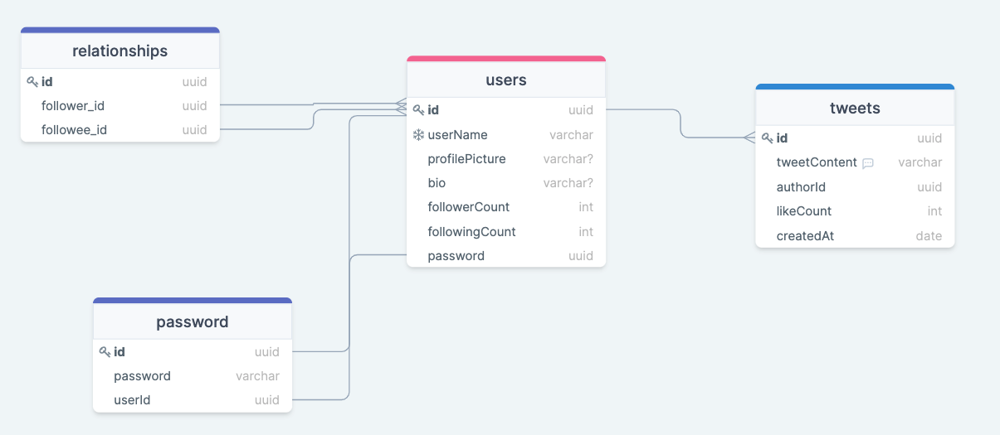

# Twitter clone

This is just a simple twitter clone.

## Installation

```bash
$npm install
```

## Running the app

```bash
# development
$ npm run start

# watch mode
$ npm run start:dev

# production mode
$ npm run start:prod
```

## Database setup

create database twitterclone;
create user useradmin with password 'anypass';
grant all privileges on database twitterclone to useradmin;

## Database schema




